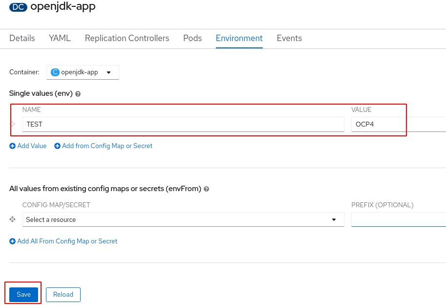
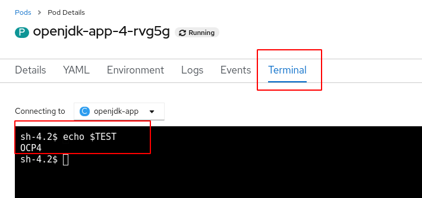
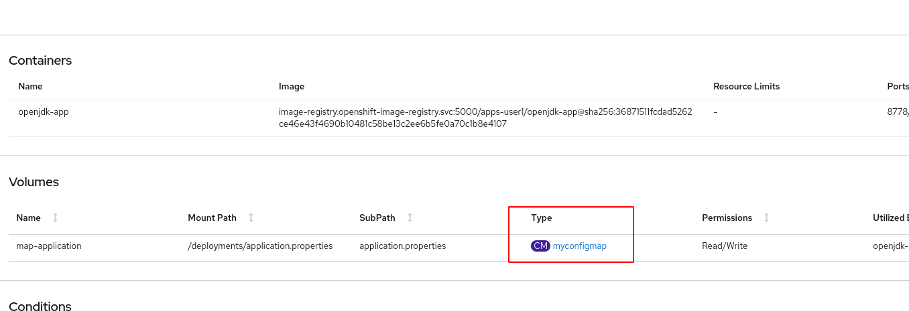
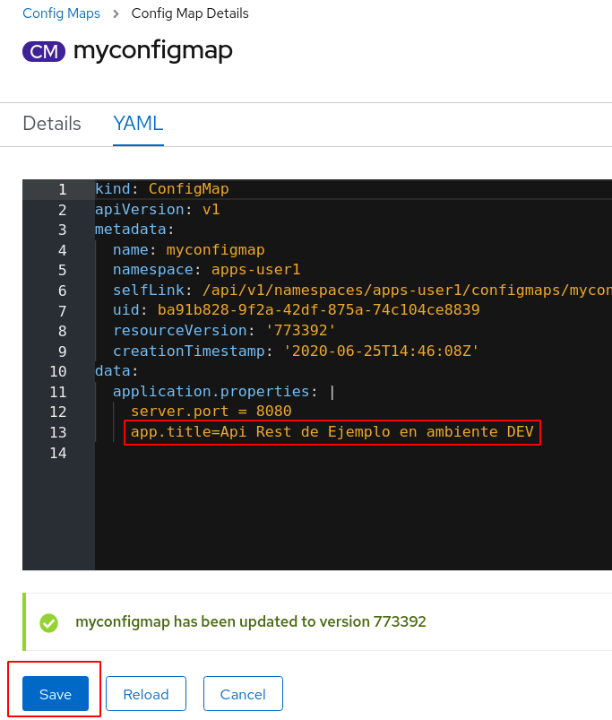
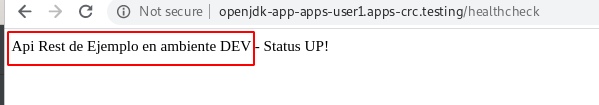
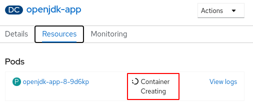
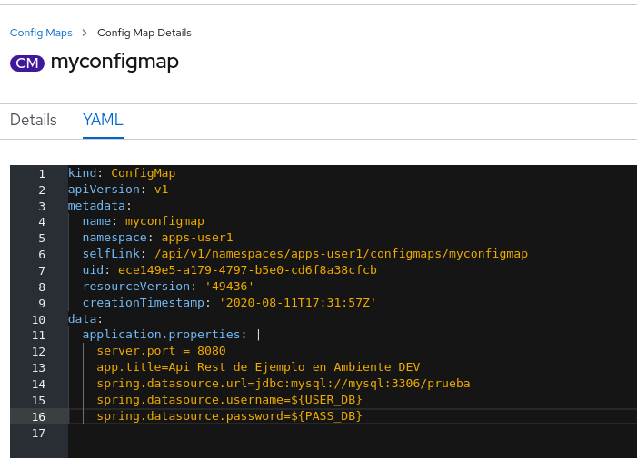

## 4 ConfigMaps y Secrets

[Volver](../README.md)

### 4.1 Variables de entorno.

Las variables de configuración de nuestras aplicaciones pueden ser definidas en variables de entorno. En el siguiente ejercicio vamos a configurar una variable de entorno en el __DeploymentConfig__ y vamos verificar su valor dentro del pod.

1. Ir a __Topology__ y seleccionar nuestra aplicación openjdk-app.
2. Seleccionar el tab __Details__ y en el menu de acciones seleccionar __​Edit Deployment Config__. El recurso __Deployment Config__ es el encargado de almacenar configuraciones asociados al despliegue de los pod de nuestra aplicación.
3. Dar clic en el Tab __Environment__
4. En esta página veras dos secciones, una primera sección permite la configuración de variables de entorno de manera manual y una segunda sección que permite la configuración desde configmaps y secrets. En este ejercicio nos enfocaremos en la primera sección.
5. Agregar la variable de entorno con nombre __TEST__ y valor __OCP4__ y dar clic en __SAVE__.
Dado que por defecto existe un Trigger asociado a cambio en la configuración , se lanzará automáticamente el despliegue justo después de guardar los cambios.



7. Vamos a __Topology__, seleccionamos la aplicación openjdk-app  y luego al tab __Resources__. Seleccionamos el pod y nos dirigimos al tab __Terminal__.
8. En la terminal ejecutamos este comando ``echo $TEST`` y debemos ver el valor previamente configurado en las variables de entorno.


  

### 4.2 Config Maps - Cambio Propiedad

Muchas aplicaciones requieren configuraciones que se pueden realizar en archivos o variables de entorno. Una buena práctica es desacoplar estas configuraciones de nuestras imágenes mediante el uso de ConfigMaps.
Para el caso de nuestro ejemplo que corresponde a una aplicación SpringBoot, a continuación se muestran los comandos que permiten la creación del configmap a partir del archivo application.properties (Archivo de configuración común en este tipo de aplicaciones).

1. Clonar el repositorio. Omita este paso si ya había clonado el repositorio previamente.

```
git clone https://github.com/wilmeraguilera/lab-openshift.git
```

2. Ubicarnos en la ruta __lab-openshift/backend-users/src/main/resources__
En este folder existe un archivo llamado application.properties

3. Debemos conectarnos al cluster por medio del cliente oc y seleccionar el proyecto donde está desplegada nuestra aplicación openjdk-app.
El proyecto debe llamarse apps-#USERNAME#

4. Proceder a crear el config-map
```
oc create configmap myconfigmap --from-file=application.properties
```

5. Luego se debe montar el archivo dentro del contenedor, para hacerlo se debe ejecutar el siguiente comando que se encarga de configurar el volumen dentro del DeploymentConfig. Este cambio requiere que se despliegue de nuevo la aplicación.

```
oc set volume dc/openjdk-app --add --name=map-application --mount-path=/deployments/application.properties --sub-path=application.properties --configmap-name=myconfigmap
```
Dado que se modificó directamente el DeploymentConfig se lanzará el deploy automáticamente.

6. Verificar que el pod haya iniciado de nuevo. Podemos ejecutar el siguiente comando para ver los pods que están ene ejecución en el proyecto.
``oc get pods``

Deberiamos ver una salida como la siguiente:

```shell script
[wilmeraguilera@localhost resources]$ oc get pods
NAME                   READY   STATUS      RESTARTS   AGE
openjdk-app-1-build    0/1     Completed   0          26d
openjdk-app-1-deploy   0/1     Completed   0          26d
openjdk-app-2-deploy   0/1     Completed   0          21h
openjdk-app-4-deploy   0/1     Completed   0          15h
openjdk-app-5-deploy   0/1     Completed   0          25m
openjdk-app-6-deploy   0/1     Completed   0          10m
openjdk-app-7-ctj49    1/1     Running     0          16s
```

En la salida anterior podemos observar un pod que se encuentra en estado __Running__ y cuyo nombre inicia por __openjdk_app__.

7. Ahora debemos conectarnos al pod por ssh, para hacer esto ejecutamos el siguiente comando con el nombre del pod deseado.

```shell script
oc rsh openjdk-app-7-ctj49
```

8. Ya dentro del pod vamos al directorio */deployments* con el comando ``cd /deployments``
y listamos los archivos que se encuentran allí  ``ls -l``

Veremos una salida similar a esta.

```shell script
sh-4.2$ ls -l
total 43960
-rw-r--r--. 1 root 1000620000       49 Jun 25 15:16 application.properties
-rw-rw-r--. 1  185 root       45004399 May 29 21:21 backend-users-0.0.1-SNAPSHOT.jar
drwxrwxr-x. 2  185 root              6 Apr 21 11:57 data
drwxrwxr-x. 2  185 root             66 May 29 21:21 openshift
-rw-rw-r--. 1  185 root            904 May 29 21:21 settings-maven.xml
```

Allí vemos que existe un archivo llamado application.properties que fue el que acabamos de montar.
Nota: Para el caso de aplicaciones SpringBoot es posible cargar el archivo application.properties desde fuera de jar y tendrá prioridad sobre los archivos de propiedades dentro del jar. Por esta razón nuestra aplicación ya está leyendo el archivo que montamos mediante el config map.
Nuestra aplicación lee del archivo application.properties una propiedad llamada app.title y es usada por el api en la operación GET healthcheck.

9. Verificar respuesta servicio healthcheck
Obtenemos la ruta con el comando ``oc get route`` y le adicionalmente el path /healthcheck

En mi caso quedaría así:
http://openjdk-app-apps-user1.apps-crc.testing/healthcheck

Para verificar el valor debemos acceder a la url mediante el navegador o mediante curl con el siguiente comando:

```shell script
curl -X GET "http://openjdk-app-apps-user1.apps-crc.testing/healthcheck" -H "accept: */*"
```
Debemos ver una salida con el valor de la propiedad y el texto "Status UP!"

10. Modificar en el config map la propiedad  app.title.

En la consola web de openshift buscar el deployment config de nuestra aplicación, ubicarnos en el tab __Details__ y seleccionar el configmap llamado myconfigmap en la sección __Volumes__.



11. Ya dentro del config map debemos ir al menu de acciones y dar clic __Edit Config Map__, colocar el valor deseado en la propiedad app.title, luego dar clic en __Save__



12. Para que tome los cambios de config map dentro de nuestra aplicación es necesario hacer un nuevo deploy (Importante tener en cuenta que no estamos cambiando la imagen de contenedor lo que estamos realizando es cambiar la configuración del despliegue).
Para ejecutar el despliegue lo podemos hacer mediante el uso del  siguiente comando.

``oc rollout latest dc/openjdk-app``

13. Esperemos un poco a que el deploy termine y vamos de nuevo a la ruta a verificar la salida del servicio /healthcheck

Deberíamos ver una salida con el valor que configuramos. 




### 4.2 Config Maps - Base de datos

En el siguiente ejercicio vamos a realizar un cambio en el recurso application.properties desde el config-map con el fin de lograr conectar el api rest a la base de datos mysql.

1. Crear la tabla user en la base de datos prueba.

Para realizar esta actividad debe buscar el pod de mysql ```oc get pod```, y conectarse al pod con el comando ``` oc rsh <nombre-pod>```.

Ya dentro del pod conectarse a mysql con el siguiente comando. ```mysql -uroot -ppassword``` y seleccionar la base de datos prueba ```use prueba;```

Y luego proceder a crear la tabla.

```shell script
CREATE TABLE user ( 
  id bigint(20) NOT NULL,  
  email varchar(255) DEFAULT NULL, 
  last_name varchar(255) DEFAULT NULL, 
  name varchar(255) DEFAULT NULL, 
  phone_number varchar(255) DEFAULT NULL, 
  PRIMARY KEY (`id`) 
);
```

Crear datos de prueba ejecutando los siguientes scrips.

```shell script
insert into user
values(10001, 'test@gmail.com',  'Mysql', 'DB', '123456789');
``` 


2. En la consola web del Openshift buscar el config-map llamado myconfigmap, y adicionar el siguiente contenido. Estas propiedades permitirán que nuestra API se conecte a la base de datos Mysql.

```
spring.datasource.url=jdbc:mysql://mysql:3306/prueba
spring.datasource.username=root
spring.datasource.password=password
```

En estos valores de configuración es importante mencionar que la url para la conexión a la base de datos tiene el siguiente formato *jdbc:mysql://{host}:{port}/{database}*
El valor de {host} corresponde al Service llamado __mysql__ que fue previamente creado y que nos proporciona acceso a la base de datos desde la red interna de openshift.

Si desea consultar los __service__ que tenemos en el proyecto ejecute el siguiente comando ```oc get service ```

El puerto es 3306 y fue definido al momento de la creación de la base de datos. 

2. Para que tome los cambios del config map y que se reflejen en el sistema de archivos del pod es necesario hacer un rollout de la aplicación.

Ir al __Topology__ seleccionar la aplicación openjdk-app y en el menú de acciones de la parte superior derecha dar clic en __Start Rollout__. Este comando desplegará la aplicación con la misma imagen pero con la nueva configuración del config map.


Veremos que se elimina el pod que estaba en ejecución y se crea uno nuevo.



Dar clic en el vínculo __View logs__ y verificar los log de inicio de la aplicación donde se observa que carga usando la base de datos mysql.


3. Verificar que nuestra api está leyendo la base de datos.

Para hacerlo debemos podemos ejecutar el siguiente comando curl. __Debe reemplazar el texto {route} por la ruta de su aplicación.__ o puede hacer la petición mediante postman. 

```shell script
curl -X GET "http://{route}:8080/users" -H "accept: */*"
```

La respuesta debería ser como la siguiente y corresponde al registro que insertamos a la base de datos:
```shell script
[{"id":10001,"email":"test@gmail.com","lastName":"Mysql","name":"DB","phoneNumber":"123456789"}]
```

4. Crear un nuevo registro mediante el API

Ejecute la petición para crear nuevos registros. __Reemplace el valor de {route} de acuerdo a su ambiente__

* Http Method: POST
* Url: {route}
* Path: /users
* Headers:
    Content-Type:  application/json
* Body:
{
    "email": "micorreo@gmail.com",
    "lastName": "Martinez",
    "name": "Andrés",
    "phoneNumber": "310000000"
}


Alternativamente puede ejecutar el siguiente comando curl

```shell script
curl -v -X POST   http://openjdk-app-apps-user1.apps-crc.testing/users   -H 'content-type: application/json'   -d '{
    "email": "micorreo@gmail.com",
    "lastName": "Martinez",
    "name": "Andrés",
    "phoneNumber": "310000000"
}'
```


5. Verificar los nuevos registros en la base de datos.

Ingrese al pod de mysql haciendo uso del comando ```oc rsh {nombre-pod}```,  ya dentro del pod conéctese a la base de datos y verifique los nuevos registros en la tabla __users__.


### Secrets

En el ejercicio anterior los datos de usuario y contraseña de la base de datos están configurados en un config-map. Vamos a realizar unos pequeños ajustes para almacenar estos datos en un Secret.

1. Crear el Secret en Openshift

```shell script
 oc create secret generic db-credentials  --from-literal USER_DB=root --from-literal PASS_DB=password
```
2. Verificar el contenido del secret

Consulte el secret que acaba de crear con el siguiente comando.
```shell script
oc get secret db-credentials -o yaml
```

La salida que obtendrá será como la siguiente, observer que en la sección __data__ los campos *USER_DB* y *PASS_DB*  están codificados en base 64. 

```shell script
apiVersion: v1
data:
  PASS_DB: cGFzc3dvcmQ=
  USER_DB: cm9vdA==
kind: Secret
metadata:
  creationTimestamp: "2020-07-08T23:25:58Z"
  name: db-credentials
  namespace: apps-user1
  resourceVersion: "520934"
  selfLink: /api/v1/namespaces/apps-user1/secrets/db-credentials
  uid: 3fea48b4-c6ae-4014-b46d-eed1d03f39d8
type: Opaque
```
3. Ahora vamos a crear las variables de entorno en el __DeploymentConfig__ a partir del secret.

Ejecute el siguiente comando
```shell script
oc set env dc/openjdk-app --from=secret/db-credentials
```

Verifique la estructura del deployment config después de asociar el secret como variables de entorno.

```shell script
oc get dc openjdk-app -o yaml
```
Observe la estructura del yaml y específicamente la sección donde se montan las variables de entorno.

```shell script
containers:
      - env:
        - name: PASS_DB
          valueFrom:
            secretKeyRef:
              key: PASS_DB
              name: db-credentials
        - name: USER_DB
          valueFrom:
            secretKeyRef:
              key: USER_DB
              name: db-credentials
        image: image-registry.openshift-image-registry.svc:5000/apps-user1/openjdk-app@sha256:9d7b7a10f1b647dfd629c44b1ce30c1c98511d2d682338936c0f7f94d2771f1a
        imagePullPolicy: Always
        name: openjdk-app
``` 

4. Ajustar la aplicación para que haga uso de las variables de entorno. 

Haciendo uso de la consola web de openshift, ingrese al config-map de la aplicación llamado __myconfigmap__ y edite las propiedades que hacen referencia al usuario y password de la base de datos, nuestro objetivo es hacer uso del secret que ahora está como variable de entorno.

Las dos variables deben quedar de la siguiente manera

spring.datasource.username=${USER_DB}
spring.datasource.password=${PASS_DB}


A continuación se puede observar como debe quedar el config map al cambiar las dos propiedades. 


Dar clic en __Save__

5. Ahora debe desplegar los cambios dando clic en __Start Rollout__  desde la consola web


Alternativamente la misma actividad se puede ejecutar desde la línea de comando con la siguiente instrucción.

```shell script
oc rollout latest dc/openjdk-app
```


6. Ingrese al pod de la aplicación y verifique las variables de entorno.
```shell script
oc rsh {nombre-pod}  
```

Ejecute los siguientes comando uno a uno para observar los valores
```shell script
echo $USER_DB
echo $PASS_DB
```

7. Verifique que la aplicación sigue operando con normalidad.

[Volver](../README.md)