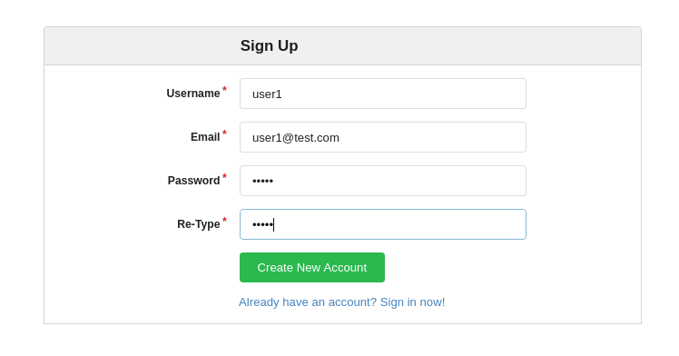
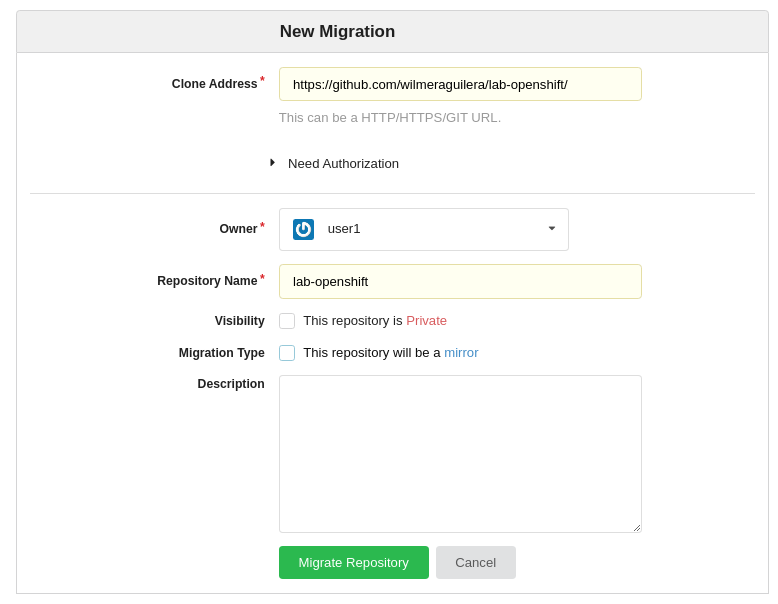
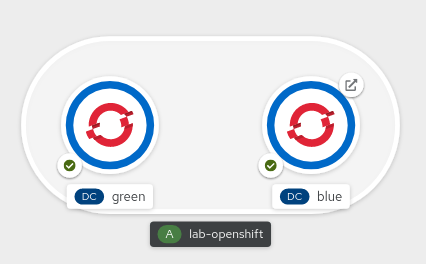
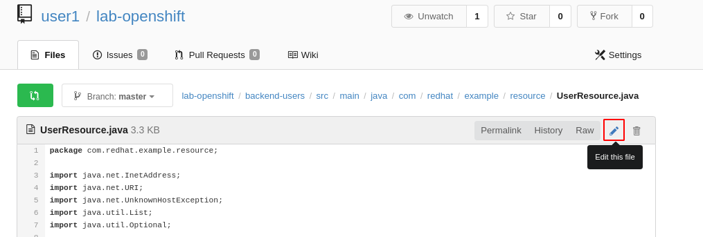
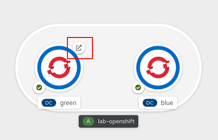

# 5. Estrategias de Despliegue basadas en Deployment Config

A nivel de Openshift existen varias estrategias de despliegue basadas en router que podemos usar de acuerdo a las necesidades:

Blue Green Deployment:

#### Deployment A/B

La estrategia de despliegue A/B le permite probar una nueva versión de la aplicación de forma limitada en el entorno de producción. 
Puede especificar que la versión de producción reciba la mayoría de las solicitudes de los usuarios, mientras que una fracción limitada de las solicitudes va a la nueva versión.
Debido a que controla la parte de las solicitudes para cada versión, a medida que avanza la prueba, puede aumentar la fracción de solicitudes a la nueva versión y finalmente dejar de usar la versión anterior. A medida que ajusta la carga de la solicitud en cada versión, el número de Pods en cada servicio también puede tener que escalarse para proporcionar el rendimiento esperado.


Para que esto sea efectivo, tanto la versión antigua como la nueva deben ser lo suficientemente similares como para que ambas puedan ejecutarse al mismo tiempo. Esto es común con las versiones de corrección de errores y cuando las nuevas características no interfieren con las antiguas.


A continuación se va a desplegar un GOGS que es un SCM basado en Git para realizar los próximos laboratorios.

## 5.1 Despliegue GOGS

1. Crear un nuevo proyecto basado en su identificador de usuario  
```shell script
oc new-project gogs-user# --display-name="SCM - User#"
```

2. Crear la aplicación a partir de un template mediante el siguiente comando:
*Revise el comando y reemplace de acuerdo a su usuario asignado*

```shell script
oc new-app -f https://raw.githubusercontent.com/mirkhala/gogs-openshift-docker/master/openshift/gogs-template.yaml -p HOSTNAME=gogs-user#-gogs.[YOUR SERVER] -p SKIP_TLS_VERIFY=true -n gogs-user#
```
3. Verificar los pods. Debemos tener dos pods en estado __Running__ que están asociados a la base de datos y otro a la aplicación Gogs. 

```shell script
$ oc get pods
NAME                       READY   STATUS      RESTARTS   AGE
gogs-1-2ljk4               1/1     Running     0          106s
gogs-1-deploy              0/1     Completed   0          109s
gogs-postgresql-1-deploy   0/1     Completed   0          114s
gogs-postgresql-1-vmfz8    1/1     Running     0          111s
```
Si los pods aún no están disponible debemos esperar un poco y verificar de nuevo.

4. Obtener la ruta.

```shell script
$ oc get route
NAME       HOST/PORT                                PATH   SERVICES   PORT        TERMINATION   WILDCARD
gogs       gogs-user1-gogs.apps-crc.testing                gogs       3000-tcp                  None
gogs-ssh   securegogs-user1-gogs.apps-crc.testing          gogs       10022-tcp                 None
```

Tomar la url asociada a la ruta llamada gogs y acceder mediante el navegador. En mi caso debo acceder  a la ruta http://gogs-user1-gogs.apps-crc.testing
 

5. Al acceder a la aplicación mediante el navegador dar clic en __Register__ y proceder a registrarnos en la herramienta:
Ingresar los siguientes datos:

*Revise los valores y reemplace de acuerdo a su usuario asignado*

* Username: user# 
* Email: user$@test.com
* Password: user#
* Re-type: user#

A continuación un ejemplo de los datos diligenciado para user1



6. Migrar el repositorio al gogs.

En primera instancia debemos autenticarnos a gogs con el usuario recién creado, luego damos clic en __Mirror__ en la parte superior derecha.

Diligenciar los siguientes datos:

__Clone Address__: https://github.com/wilmeraguilera/lab-openshift/
__Repository Name__: lab-openshift
__Migration Type__: Desmarcar el check "This repository will be a mirror"

*Los demás valores dejarlos por defecto*

A continuación un ejemplo del diligenciamiento con user1


 

## 5.2 Blue Green

Blue Green es una estrategia que busca reducir el tiempo de indisponibilidad de una aplicación al momento de realizar un despliegue. Se requiere tener dos ambientes idénticos llamados "Blue" y "Green, uno de ellos tendrá la version estable y el otro la nueva versión. Cuando todo este correcto lo único que se cambia es la ruta para que apunte al ambiente con la nueva versión.

1. Ubicarnos en el proyecto apps-user# y verificar que no exista ningún recurso creado.

```shell script
oc project apps-user# 
```

2. Crear la aplicación Blue

Tener especial cuidado de reemplazar los valores de [URL GOGS lab-openshift] y  [ROUTE NEXUS] de acurdo a su ambiente.

```shell script
oc new-app --name=blue  openshift/java:8~[URL GOGS lab-openshift] --context-dir=backend-users --strategy=source --build-env MAVEN_MIRROR_URL=http://[ROUTE NEXUS]/repository/maven-public/ --labels app.kubernetes.io/part-of=lab-openshift
```

3. Crear la aplicación Green

```shell script
oc new-app --name=green  openshift/java:8~[URL GOGS lab-openshift] --context-dir=backend-users --strategy=source --build-env MAVEN_MIRROR_URL=http://[ROUTE NEXUS]/repository/maven-public/ --labels app.kubernetes.io/part-of=lab-openshift
```

4. Exponer la ruta del la aplicación blue. (BlueGreen tiene una unica ruta que se estará intercambiando entre el ambiente Blue y Green)

```shell script
oc expose svc blue --name=lab-openshift
```

5. Verificación creación de aplicaciones. Ir a __Topology__ y deberías ber una disposición de las aplicacione como la que se muestra a continuación.



6. Verificar respuesta del servicio /healthcheck

Ejecutar el siguiente comando curl o alternativamente navegar en la ruta desde un navegador.

*Reemplazar el valor [ROUTE APP] por la ruta en su ambiente, si desea obtenet la ruta use el comando ```oc get route ```*
```shell script
$curl -X GET "http://[ROUTE APP]/healthcheck" -H "accept: */*" 
```

La salida del comando es la siguiente (*La ip puede variar*), Note que la version es 1.0

```shell script 
{"appTitle":"Api Rest de Ejemplo","version":"1.0","ip":"10.128.0.132"}
```

7. Realizar cambios en la aplicación en el Git.

* Ingresar el gogs y seleccionar el repositorio lab-openshift
* Ir el archivo backend-users/src/main/java/com/redhat/example/resource/UserResource.java
* Dar clic en Edit File.



* En el método  healthcheck() cambiar la linea  *responseHealthCheck.setVersion("1.0");* por responseHealthCheck.setVersion("2.0");
* Dar clic en __Commit Changes__


8. Desplegar la nueva versión de la aplicación en el ambiente GREEN

* En __Topology__ seleccionar la aplicación Green y seleccionar el tab __Resources__
* Dar clic en __Start Build__, este comando compilará la aplicación con la última version de las fuentes y generará una nueva imagen.
* Debemos esperar a que termine el Build y el Deployment sobre la aplicación Green

9. Verificar que aún la ruta responde las peticiones a los usuarios con la version anterior (Aplicación BLUE).
* Ejecutar de nuevo el comando curl 

```shell script
$curl -X GET "http://[ROUTE APP]/healthcheck" -H "accept: */*"
```
* La salida sigue siendo igual ya que la ruta sigue apuntando a la aplicación BLUE
```shell script
{"appTitle":"Api Rest de Ejemplo","version":"1.0","ip":"10.128.0.138"}
```

10. Editar la ruta para apuntar al __service__ de la aplicación GREEN
* Ir a __Topology__ y seleccionar la aplicación BLUE
* En la sección __Routes__ y seleccionar la ruta __lab-openshift__
* Ir al tab __YAML__
* Buscar la sección del archivo que define el servicio al cual apunta la ruta y cambiar __blue__ por __green__.

Antes:
```shell script
...
to:
    kind: Service
    name: blue
...
```

Después:
```shell script
...
to:
    kind: Service
    name: green
...
```

Dar clic en __Save__
 

11. Verificar la nueva version de la aplicación. 

Ejecutar el comando curl o acceder a la ruta desde un navegador
```shell script
$curl -X GET "http://[ROUTE APP]/healthcheck" -H "accept: */*"
```
La salida será similar a la siguiente donde veremos la version 2.0 o una IP diferente con respecto a la aplicación BLUE.

```shell script
{"appTitle":"Api Rest de Ejemplo","version":"2.0","ip":"10.128.0.141"}
```

Al ir a __Topology__ veremos que se actualiza el gráfico y ahora la ruta está en la aplicación GREEN.




## 5.3 A/B Deployment

Básicamente esta estrategia de despliegue consiste realizar en tener dos ambientes, realizar el despliegue y enviar un porcentaje de las peticiones al nuevo despliegue y monitorear su comportamiento.

Para realizar el siguiente taller haremos uso del ambiente creado en el laboratorio anterior, y modificaremos la ruta para dividir el tráfico entre el ambiente Blue y Green.


1. Eliminar la ruta con el siguiente comando.

```shell script
oc delete route lab-openshift
```


2. Crear la de nuevo la ruta, pero en esta ocasión enviaremos el 90 % del tráfico al ambiente blue y el 10 % del tráfico a la versión green.
Para hacer esto se define un peso en cada servicio, el peso es un valor este 0 y máximo 256 donde 0 indica que no se enviará trafico a ese servicio. 

A continuación se muestra el json para la creación de la ruta bajo las condiciones previamente mencionadas:

```yaml
{
  "apiVersion": "route.openshift.io/v1",
  "kind": "Route",
  "metadata": {
    "labels": {
      "app.kubernetes.io/part-of": "lab-openshift"
    },
    "name": "lab-openshift"
  },
  "spec": {
    "port": {
      "targetPort": "8080-tcp"
    },
    "to": {
      "kind": "Service",
      "name": "blue",
      "weight": 90
    },
    "alternateBackends": [
      {
        "kind": "Service",
        "name": "green",
        "weight": 10
      }
    ],
    "wildcardPolicy": "None"
  }
}
```


 


